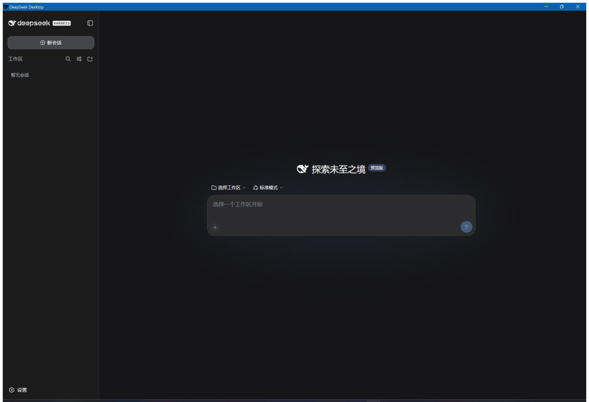
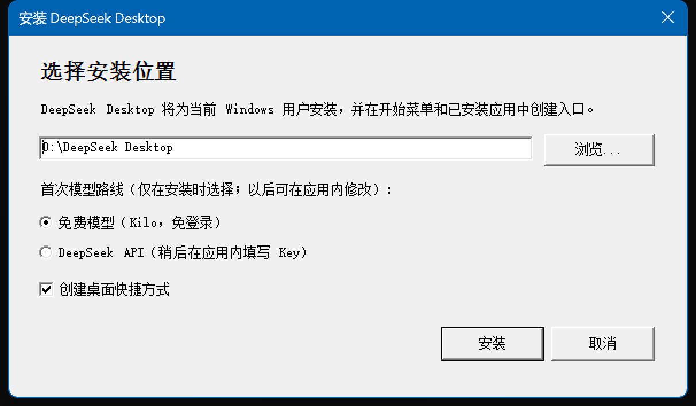
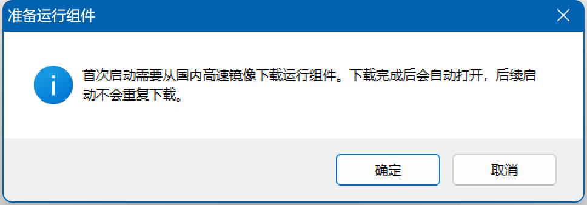
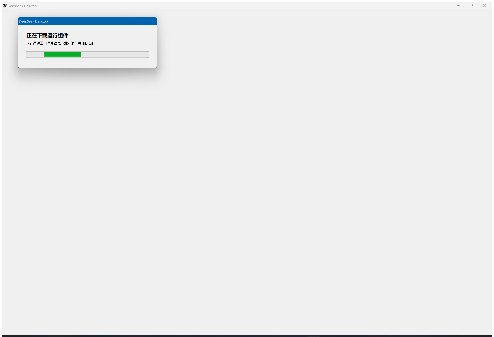

# DeepSeek Desktop：Windows 版 DeepSeek Harness

> DeepSeek Desktop 是由社区维护的 Windows x64 发行项目，基于已发布的 `@deepseek-ai/dsh` 构建。它不是 DeepSeek 官方桌面客户端，也不包含任何 API Key。

## 在桌面窗口中运行

DeepSeek Desktop 会在本机启动 Harness 服务，并在名为 `DeepSeek Desktop` 的内置 WebView2 窗口中加载界面，不会另行打开默认浏览器。界面默认使用中文，之后仍可在应用内切换语言。

## 安装时选择模型路线

安装向导只在安装时询问一次初始模型路线；安装完成后仍可在应用内修改，后续启动不会重复询问。

- **免费模型（Kilo，免登录）**：默认选中 Kilo Auto Free，不要求登录或 API Key，也不是本地模型。Kilo 官方说明免费模型支持匿名访问并按 IP 限速；免费额度、具体路由和可用性由 Kilo 决定。Auto Free 可能把请求转发给会记录输入和输出的第三方服务，不要提交个人、机密或敏感内容。
- **DeepSeek API**：启用 Harness 内置的 DeepSeek 路由，用户稍后在应用内填写自己的 API Key；安装包不会附带密钥。

## 选择安装包

| 安装包 | 适用情况 |
| --- | --- |
| `Windows-x64-Setup-默认.exe` | 体积较小；首次启动时从 `registry.npmmirror.com` 下载固定的 Harness 依赖，并使用系统已有的 WebView2 runtime。适合首次启动可以联网的机器。 |
| `Windows-x64-Offline-Setup.exe` | 内置 Harness 完整依赖和固定版 WebView2 runtime，安装组件无需另行下载。Kilo 与 DeepSeek API 的模型请求仍需联网。 |

## 安装与首次启动

1. 从项目 [Release](https://github.com/121103qwq/deepseek-desktop/releases/tag/deepseek-desktop-v0.1.0) 下载适合的安装包。
2. 运行安装程序，选择安装位置、初始模型路线及是否创建桌面快捷方式。
3. 点击“安装”。程序会为当前 Windows 用户安装，不请求管理员权限，也不修改系统 `PATH`。
4. 安装完成后 DeepSeek Desktop 会自动启动。标准版首次启动会先确认下载，再显示运行组件下载进度；离线版直接打开本地界面。

依赖已经存在时，标准版不会再次下载。两个版本都会创建开始菜单入口和 Windows“已安装的应用”记录，桌面快捷方式由用户在安装向导中决定。

## 卸载与数据保留

在 Windows“设置 → 应用 → 已安装的应用”中找到 `DeepSeek Desktop` 并选择“卸载”。卸载程序会停止桌面窗口和随附的 Node 服务，并删除程序文件、注册项、开始菜单入口和桌面快捷方式。

会话与设置保存在 `%LOCALAPPDATA%\DeepSeek Harness Data`，卸载时会保留，方便以后重装继续使用。需要完全清除时，可在退出应用后自行删除该目录。

## 使用前须知

当前发行仅支持 Windows x64。安装程序是未签名的社区构建，Windows 可能显示“未知发布者”；请只从项目 Release 下载。

Kilo 匿名访问说明和 Auto Free 数据处理提示见 [Kilo 官方文档](https://kilo.ai/docs/gateway/authentication) 与 [Using Kilo for Free](https://kilo.ai/docs/getting-started/using-kilo-for-free)。
